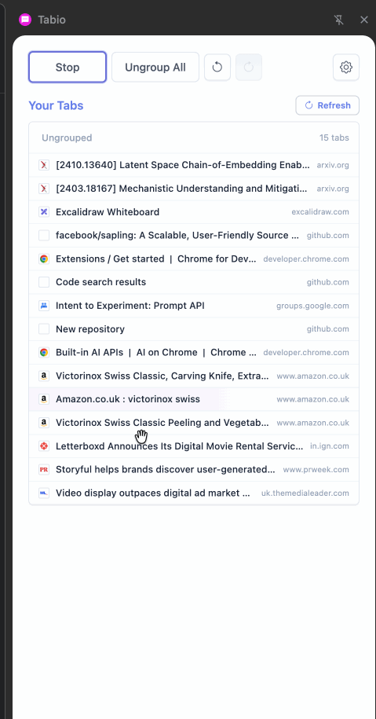

# Tabio AI Tab Organiser

An AI-powered Chrome extension that automatically organizes your browser tabs into logical groups using Google's Gemini Nano. Runs entirely on-device for privacy and speed.



## Features

- 🤖 **AI Organization** - Automatically categorizes tabs into 3-7 logical groups
- 🎨 **Visual Management** - Drag and drop tabs between groups in a clean sidebar
- ⏮️ **Undo/Redo** - Full history tracking with unlimited undo/redo
- 🎯 **Group Controls** - Collapse/expand groups, ungroup all, color-coded organization
- ⚡ **Custom Instructions** - Guide the AI with your own categorization rules

## Setup

### Prerequisites
- Chrome 138+ (Dev or Canary)
- Enable Chrome flags for Gemini Nano

### Installation
1. Clone this repository and install:
   ```bash
   npm install
   npm run build
   ```
2. In Chrome, open `chrome://extensions/`
3. Enable **Developer mode** (top right)
4. Click **Load unpacked** and select the `dist` directory
5. Click the extension icon to open the sidebar

### Enable Gemini Nano
1. Open `chrome://flags/#optimization-guide-on-device-model`
   - Set to **"Enabled BypassPerfRequirement"**
2. Open `chrome://flags/#prompt-api-for-gemini-nano`
   - Set to **"Enabled"**
3. Fully quit and restart Chrome

Verify download at `chrome://components/` → **"Optimization Guide On Device Model"**

## Usage

- **Organize My Tabs** - AI categorizes all tabs automatically
- **Drag & Drop** - Move tabs between groups or reorder them
- **Undo/Redo** - Revert or restore changes
- **Collapse (‹)** - Click to collapse/expand groups
- **Custom Instructions** - Add rules in Advanced Settings
- **Ungroup All** - Remove all groups instantly

## Privacy

All processing happens on-device. No data leaves your computer.

## License

MIT
